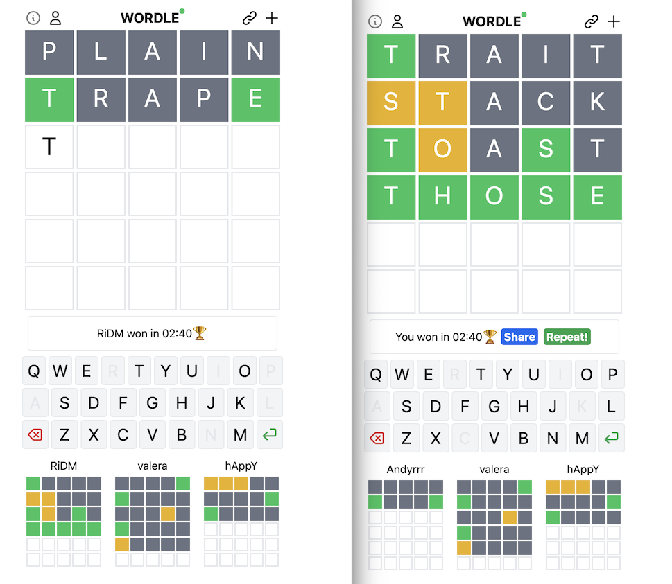

# wordle

Multiplayer wordle

In addition to the original rules there is a time competition beetween players in the game.
The faster one wins.


## Demo

https://wordle.dmitry.it

## Acknowledgements

[Wordle](https://www.nytimes.com/games/wordle/index.html) is an original idea. 
[Copilot](https://copilot.github.com) is the best pair programmer ever! It wrote 60-70% of frontend code :)


## Development
Backend: [Iodine](https://github.com/boazsegev/iodine), Frontend: [React](https://github.com/facebook/react) + [Tailwind CSS](https://github.com/tailwindlabs/tailwindcss)


Requirements:
 - ruby
 - redis

0. clone repo
1. run `bundle install` in source directory
2. run the tests by using this command `APP_ENV=test REDIS_URL=redis://localhost:6379/2 bundle exec ruby setup/prepare_test_db.rb && bundle exec rspec`

3. fill the dictionaries if all the above steps have been completed successfully
  ```
  redis-cli
  127.0.0.1:6379> SADD words_en plain
  127.0.0.1:6379> SADD available_words_en plain 
  ```
Also, use the setup scripts to populate dictionaries with words [from internet](https://github.com/dm1try/wordle/blob/a9d0babd0711d39ad8fc3f4f9bf8ee9efaa5622a/setup/seed_dictionary.rb#L1-L2).

4. run application locally with `bundle exec ruby app.rb`
